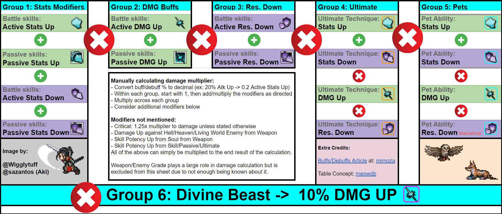

# CotC Buffs & Debuffs — the canonical model

This folder documents how buffs and debuffs combine into damage in
*Octopath Traveler: Champions of the Continent*. The model is anchored on
the bucket diagram (`buff_debuff_groups.jpeg`) by **@Wigglytuff /
@sazantos (Aki)**, with the original taxonomy credited to **mimoza**'s
buffs/debuffs article and **meowdb**'s table concept.

The taxonomy here is **not** parsed by any code in this repo today; skill
descriptions live in `db/schema.sql` as plain TEXT. These docs are a
human reference for game mechanics — a stable spec that can later be used
to inform skill parsing, character recommendations, or `/character` embed
annotations.

> **Files**
> - `README.md` — this file: glossary, six groups, formula
> - `examples.md` — worked calculations (Lynette, Richard, Kilns, Mydia, …)
> - `edge_cases.md` — Boost Lv, special caps, multi-hit, defensive math, …
> - `buff_debuff_groups.jpeg` — source image

## Glossary

| Term | Meaning |
|------|---------|
| **Buff** | Effect that improves an ally (or self) — e.g., +20% Atk Up. |
| **Debuff** | Effect that worsens an enemy — e.g., −20% Def Down on enemy. |
| **Active** | Effect granted by a battle skill or EX skill (turn-limited). |
| **Passive** | Effect that's always on while a condition holds (no SP cost, no turn timer in the active sense). Includes A4 accessory effects, latent passives, and conditional passives like "While at Full HP, …". |
| **Ultimate** | Effect granted by a unit's Ultimate Technique. Lives in its own group. |
| **Pet** | Effect granted by a Pet ability. Lives in its own group. |
| **Divine Beast** | A flat +10% DMG Up that occupies its own group. |
| **Sub-bucket** | The smallest pool inside a group — e.g., "Active Atk Up" is one sub-bucket; "Passive Sword DMG Up" is another. Each sub-bucket has its own 30% cap. |
| **Cap** | The maximum total a single sub-bucket can contribute. Default is 30%; see `edge_cases.md` for exceptions. |
| **Exploit** | When a skill of one weapon/element inflicts damage typed as another (e.g., a Sword skill that hits a Fire-weak enemy as Fire). The **original** weapon/element governs which buffs apply. |
| **Alignment** | Each enemy is one of Hell / Heaven / Living World. Some weapons have a "damage up vs [alignment]" attribute that adds to a final-multiplier pool. |
| **Soul** | An item equipped to a weapon that can grant Soul Potency Up. |
| **Potency Up** | Per-skill scaling distinct from generic DMG Up. Comes from souls or from skills/passives/ultimates that explicitly call it out. |

## The six groups

The diagram divides every buff/debuff into one of six groups. The group
sets the math; the sub-bucket sets the 30% cap.

```
G1 (Stats)  ×  G2 (DMG Up)  ×  G3 (Res Down)  ×  G4 (Ultimate)  ×  G5 (Pets)  ×  G6 (Divine Beast)
```

### G1 — Stats Modifiers

**Scope:** the four core stats only — **Atk, Mag, Def, MDef** — plus
**Crit chance Up**.

**Sub-buckets:** `(Active | Passive) × (Up | Down) × (stat type)`. So
"Active Atk Up" is one sub-bucket; "Passive Def Down" (debuff on enemy) is
another.

**Within G1:** every modifier across every sub-bucket sums **additively**
into one Group 1 total. Each sub-bucket is capped at 30% before the sum.

```
G1 = 1 + Σ ( min(30%, sum of modifiers in sub-bucket) )   over all sub-buckets in G1
```

> *Example.* A unit has 10% Active Atk Up, 7% Passive Atk Up, 11%
> Active Def Down on the enemy, and 9% Passive Def Down on the enemy.
> Each is in its own sub-bucket; none exceeds 30%; G1 contribution is
> `1 + 0.10 + 0.07 + 0.11 + 0.09 = 1.37`.

### G2 — DMG Up

**Scope:** weapon-typed and element-typed damage modifiers.
- **Weapons:** Sword, Dagger, Bow, Axe, Staff, Tome, Fan, Spear (8 types).
- **Elements:** Light, Dark, Wind, Ice, Fire, Lightning (6 types).

**Sub-buckets:** `(Active | Passive) × (type)`. So "Active Sword DMG Up" is
one sub-bucket; "Passive Fire DMG Up" is another.

**Within G2:** fully additive, same shape as G1. Each sub-bucket capped at
30%, then summed.

> Weapon/element-typed buffs apply only when the attack matches. A Sword
> skill benefits from Sword DMG Up but not Axe DMG Up; a Fire skill
> benefits from Fire DMG Up but not Ice DMG Up.

### G3 — Res Down (per type)

**Scope:** per-weapon and per-element resistance modifiers.
- **Res Down on enemy:** enemy takes more damage of that type.
- **Res Up on ally:** ally takes less damage of that type. *(Both directions live in G3.)*

**Sub-buckets:** `(Active | Passive) × (type) × (Up | Down)`.

**Within G3:** fully additive, same shape as G1/G2. Each sub-bucket capped
at 30%, then summed.

> *Example.* An A4 accessory inflicts 10% Passive Physical Res Down on
> break (umbrella — see "Umbrella buffs" below). A unit also has 15%
> Passive Sword Res Down on the enemy. Then the Passive Sword Res Down
> sub-bucket is `15% + 10% = 25%` (the umbrella adds to every per-type
> sub-bucket independently).

### G4 — Ultimate

**Scope:** any modifier sourced from an Ultimate Technique.

**Within G4:** **three multiplying sub-pools** — this is where G4 differs
from G1/G2/G3.

- **Sub-pool A — Ultimate Stats.** Ult Atk Up, Ult Mag Up, Ult Def Down on enemy, etc. Stats Up and Stats Down sum additively per stat. Each sub-bucket (Ult × stat × direction) capped at 30%.
- **Sub-pool B — Ultimate DMG Up.** Per-type (weapon or element). Each sub-bucket capped at 30%.
- **Sub-pool C — Ultimate Res Down.** Per-type. Each sub-bucket capped at 30%.

```
G4 = (1 + Σ ult-stats sub-buckets)
   × (1 + Σ ult-DMG-Up sub-buckets matching the attack)
   × (1 + Σ ult-Res-Down sub-buckets matching the attack)
```

### G5 — Pets

**Scope:** any modifier sourced from a Pet ability. Same shape as G4
(three multiplying sub-pools: Stats × DMG Up × Res Down).

> Per the diagram, **Pet Res Down is theoretical** — there's no live pet
> ability that grants it at the time of writing. The slot exists in the
> model for completeness.

### G6 — Divine Beast

**Scope:** the Divine Beast contribution. Flat **+10% DMG Up**, no
stacking, no sub-buckets.

```
G6 = 1.10   (when active)
```

## Across-group operation

The six groups **multiply**.

```
group_product = G1 × G2 × G3 × G4 × G5 × G6
```

Then several **final multipliers** are applied. Each is its own
multiplier; sources within a final-multiplier pool sum additively, and the
pools multiply across. **None of the final multipliers have a 30% cap.**

| Pool | Formula | Notes |
|------|---------|-------|
| **Crit** | `1.25 + Σ Crit Damage Up` | Applied only on a successful or guaranteed crit. Crit Damage Up is uncapped. Crit *chance* Up is a G1 stat (capped 30%), not part of this pool. |
| **Hell / Heaven / Living World** | `1 + Σ matching alignment-damage-up` | Triggered when the attacker's weapon's "damage up vs [alignment]" attribute matches the enemy's alignment. **Hell weapons have a 200% cap** (vs the standard 30%) — see `edge_cases.md`. |
| **Soul Potency Up** | `1 + Σ soul-potency-up` | From souls equipped to weapons. |
| **Skill Potency Up** | `1 + Σ skill-potency-up` | From skills/passives/ultimates that explicitly call out potency for the active skill. Distinct from generic DMG Up. |

## The full damage formula

Putting it all together, for one attack:

```
damage = base
       × G1 × G2 × G3 × G4 × G5 × G6
       × Crit
       × HellHeavenLW
       × SoulPotency
       × SkillPotency
```

Worked numerical examples are in `examples.md`.

## Stacking rules

These apply across all groups.

1. **Same skill from same unit reapplied** → duration extends, **potency does not stack**.
   - e.g., Lynette casts her 20% Atk Up twice → still 20%, longer duration.
2. **Different skills (same or different units)** → potency stacks **additively**, then the sub-bucket cap applies.
   - e.g., Lynette 20% + Richard 20% → 40% in shared Active Atk Up sub-bucket → caps to 30%.
3. **Multi-hit skill hitting same target** → each hit re-applies; duration stacks per hit; potency capped same as a single hit (treated like rule 1 across hits).
4. **Umbrella buffs** (`All Damage Up X%`, `Physical Damage Up X%`, `Elemental Damage Up X%`) → adds X% to **every** relevant per-type sub-bucket independently. Each per-type sub-bucket caps at 30% on its own.
5. **Conditional / latent passives** (`While at Full HP, …`, `While Self has 6+ Buff icons, …`) → counted as **Passive** when the condition holds.
6. **A4 accessory effects** → counted as **Passive**.
7. **Exploits** (e.g., a Sword skill exploiting Fire weakness) → buffs that apply are of the **original** weapon/element. Sword DMG Up applies; Fire DMG Up does not.
8. **Weapon/element specificity** → weapon-typed and element-typed buffs apply only when the attack matches.
9. **Defensive math** → defensive buffs (PDEF Up, MDEF Up, weapon/element Res Up on ally) follow the same bucket structure on the **defender** side. The defender's group product **divides** the attacker's damage. (See `edge_cases.md`.)
10. **Boost Lv** → varies per skill. The %, the duration, both, or neither may scale with Boost Lv. Read each skill description.

## Source image



## Credits & sources

- **Bucket diagram:** @Wigglytuff and @sazantos (Aki).
- **Buffs/debuffs article (older — reference only):** [mimoza on meowdb](http://meowdb.com/db/octopath-traveler-cotc/the-ultimate-guide-to-buffs-and-debuffs).
  The article uses an older 4-group framing (Stats / DMG / Res /
  Ultimate, with Active/Passive/Ultimate as sub-brackets *inside* each).
  The current 6-group framing in this folder supersedes it. Some formula
  details in the article are also outdated.
- **Table concept:** meowdb.

If you find a mechanic that contradicts this document, **the user (the
domain expert) is the source of truth** — open a `/feedback` and update
this folder.
